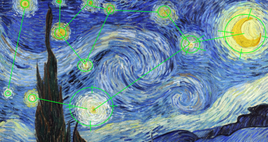
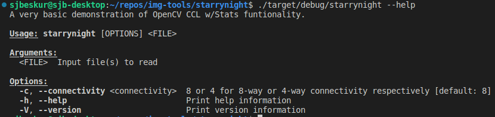

# StarryNight

Paint your pallet blue and gray, Look out on a summers day, With eyes that know the darknes in my soul.



## Prerequisites

- [Rust](https://www.rust-lang.org/)
- [OpenCV](https://github.com/opencv/opencv)

### OpenCV Setup Guide (Linux)

There are a couple different ways to install OpenCV but I typically just clone the latest repo and build it from source.

Once you clone the repo, here is an outline of the steps I usually follow

```bash
cmake -B build -S . -DCMAKE_INSTALL_PREFIX=/usr/local -DOPENCV_GENERATE_PKGCONFIG=ON -DWITH_EIGEN=OFF ..

cd build && make -j8 && sudo make install
```

### Build

```bash
git clone https://github.com/sjbeskur/starrynight.git
cd starrynight
cargo build
```

### Run

Once the cargo build completes all build artifacts will be placed in the target directory under debug or release depending on the flag you set above.

To run the application simply:

```bash
./target/release/starrynight <path_to_image>
```

e.g.

```bash
./target/release/starrynight ./img/71_stars.png
```

### Help



### TODO

- disagregate app(main ) from lib
- add verbosity levels
- output to file
- better stats and centroids
- maybe add image "moments" once I understand this better

### Addendum

While trying to understand more about moments, I came across an [entire book dedicated](https://www.amazon.com/gp/product/0470699876/) to the subject w.r.t pattern recognition.
